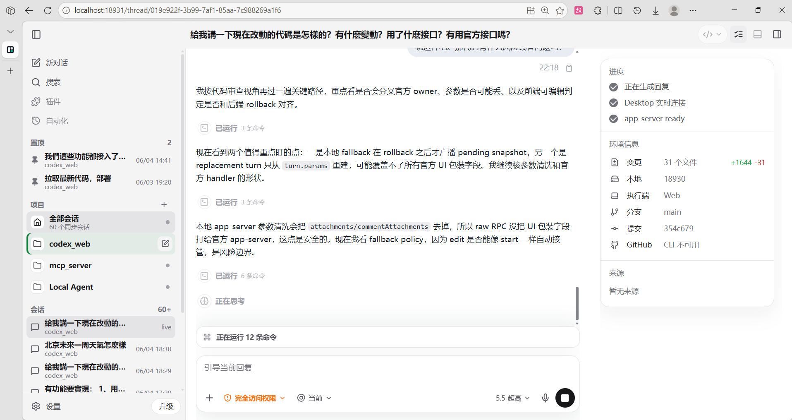
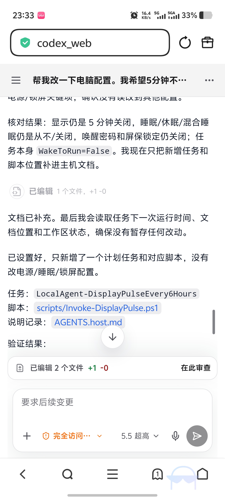

<div align="center">
  <h1>
    
    codex_web — 本地 Codex 的 Web / LAN / 移动端入口
  </h1>
  <p>
    
    
    
    
  </p>
  <p>
    简体中文 · <a href="./README.en.md">English</a>
  </p>
</div>

`codex_web` 是一个非官方的本地 Codex Web 客户端。它把 Codex Desktop 风格的会话列表、聊天区、Composer、设置/诊断和移动端访问能力放到浏览器里，并接入 Codex Desktop / VS Code Codex 扩展的实时同步链路。

项目面向本机运行和局域网访问，不是云端托管服务。后端运行在你的电脑上，负责连接官方 Codex IPC、app-server、本地 SQLite、附件存储和浏览器 Web UI。

## 界面展示



### 移动端示例



## 项目目标

Codex Desktop 很适合在电脑上工作，但它不是一个天然的浏览器/LAN/手机入口。`codex_web` 的目标是在不把会话搬到云端的前提下，把本机 Codex 工作流扩展到更多屏幕和更多操作方式：

- 在浏览器里提供接近 Codex Desktop 的主界面和交互密度
- 让手机、平板或局域网内其他设备可以访问同一台电脑上的 Codex 会话
- 与 Codex Desktop、VS Code Codex 扩展共享会话状态，并尽量保持实时同步
- 把官方协议、Web API、前端 domain model 和 UI 渲染分层，避免前端直接依赖 raw protocol
- 提供可脱敏导出的诊断材料，方便排查同步、IPC、app-server 和缓存问题

## 核心功能

- **Desktop-like 会话体验**：项目列表、普通/归档会话列表、长列表虚拟滚动、会话详情、Markdown 消息、代码块、表格、文件变更、审批卡片，以及接近 Desktop 的左栏/顶部栏/右侧栏布局密度。
- **完整 Composer**：文本输入、Enter/Shift+Enter、模型选择、推理强度、协作模式、Skills、附件、图片预览、发送后附件关联，并按会话保留未发送文本和附件草稿。
- **三端同步实验**：通过官方 IPC / app-server bridge 读取 thread list/detail，支持 follower start / steer / interrupt、stale owner 本地接管兜底，并通过 WebSocket 推送实时事件。
- **侧边聊天**：读取官方同步出的 side conversations，并支持向已有官方侧聊发送消息。
- **移动端和 LAN 访问**：响应式布局、移动抽屉、移动 Composer、运行状态折叠面板、PWA manifest、LAN URL 展示和登录门禁。
- **本地文件与附件**：受限文件浏览/预览、右侧文件标签页、消息图片渲染、file change 预览、Web 上传附件持久化和清理。
- **安全与诊断**：LAN 密码、HTTP-only session cookie、session 撤销、诊断包递归脱敏、同步 readiness、协议兼容性和 `sync:doctor` CLI。
- **测试覆盖**：TypeScript typecheck、Vitest 单元测试、Playwright 桌面/移动 E2E、UI fidelity baseline 入口。

## 快速启动

前置条件：

- Node.js 22+
- pnpm 10+
- Codex Desktop
- 可选：VS Code Codex 扩展，用于三端同步验证

安装依赖：

```powershell
pnpm install
```

开发模式：

```powershell
pnpm dev
```

默认地址：

```text
Web 开发服务器: http://127.0.0.1:18931
后端 API:       http://127.0.0.1:18930
```

生产模式：

```powershell
pnpm build
pnpm start
```

`pnpm start` 会启动 Fastify 后端，监听 `0.0.0.0:18930`，并提供构建后的 Web 静态页面。局域网设备访问时需要 LAN 密码；首次启动会生成本机私有配置和密码 hash。

## 仓库结构

```text
apps/
  server/      Fastify 后端、IPC bridge、app-server bridge、WebSocket/API
  web/         React + Vite 前端
packages/
  api/         前后端共享 API schema 和类型
  config/      运行配置、路径和端口解析
  domain/      Web domain model 和官方数据 normalizer
  i18n/        zh-CN / en-US 语言包和翻译 key
  protocol/    官方 IPC / app-server wire protocol
  ui/          UI token 出口
docs/          产品、启动、同步、排障和踩坑文档
documentation/
  protocol/    官方协议研究记录
data/          本机运行数据目录，默认被 Git 忽略
```

更多细节见 [docs/repository_overview.md](./docs/repository_overview.md)。

## 文档入口

- [启动手册](./docs/startup_runbook.md)
- [仓库结构](./docs/repository_overview.md)
- [产品规格](./docs/product_spec.md)
- [MVP 收口看板](./docs/mvp_gap_tracker.md)
- [三端同步验收清单](./docs/sync_acceptance_checklist.md)
- [同步排障指南](./docs/troubleshooting_sync.md)
- [UI 高保真基准](./docs/ui_fidelity.md)
- [Playwright E2E](./docs/playwright_e2e.md)

## 免责声明

本项目是非官方实验项目，未与 OpenAI 或 Codex Desktop 官方团队关联。Codex、OpenAI、VS Code 等名称归其各自所有者所有。

## License

MIT © 2026 shopkeeper2020. 详情见 [LICENSE](./LICENSE)。
